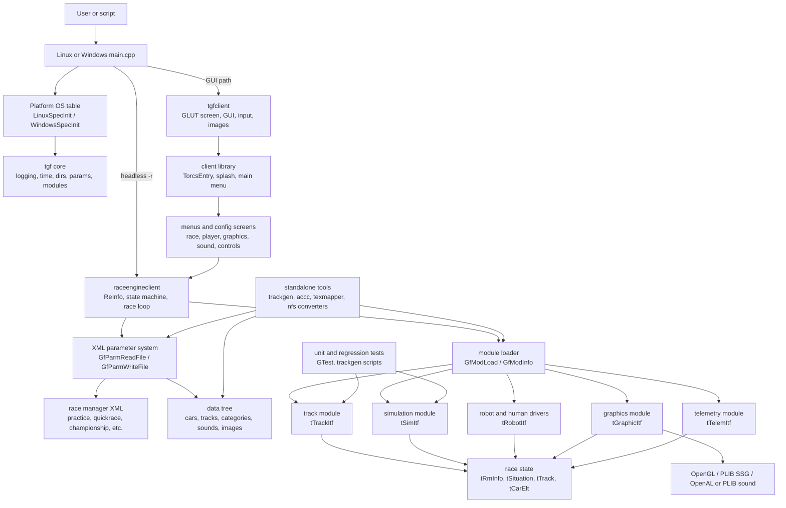
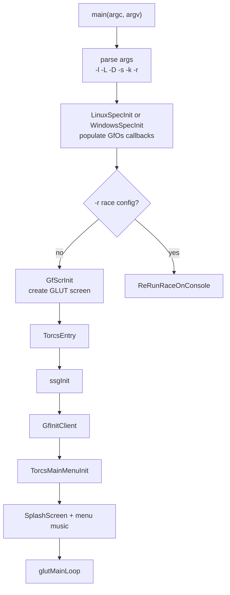
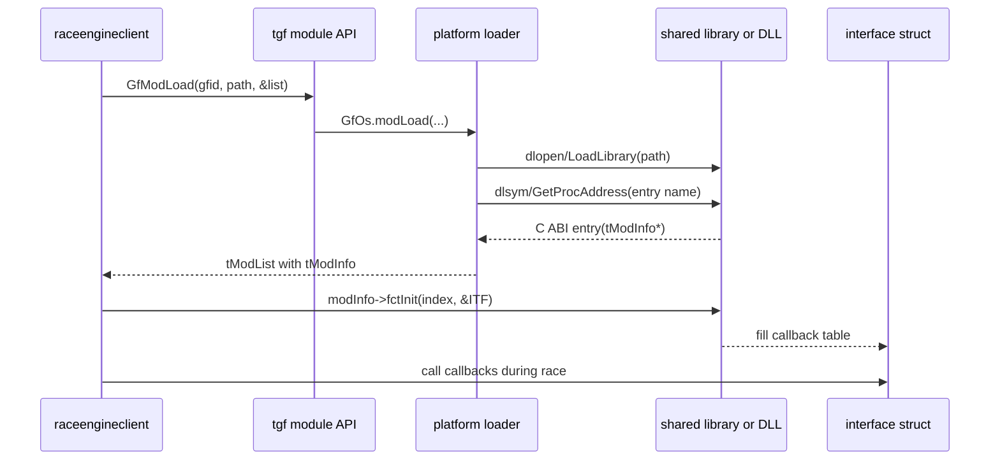
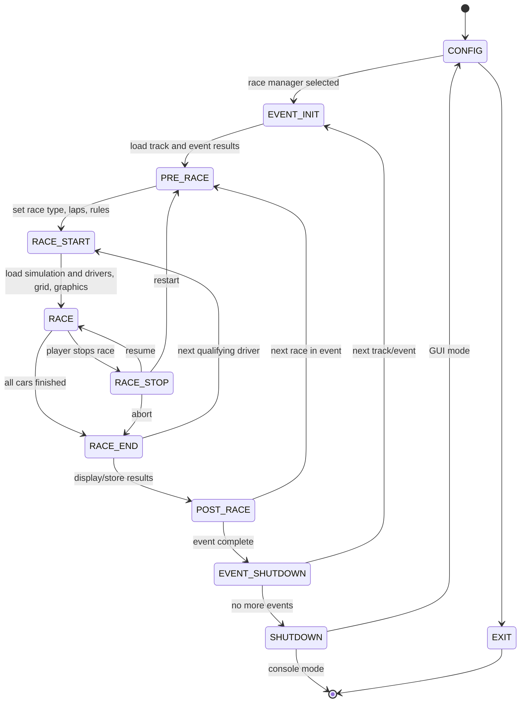
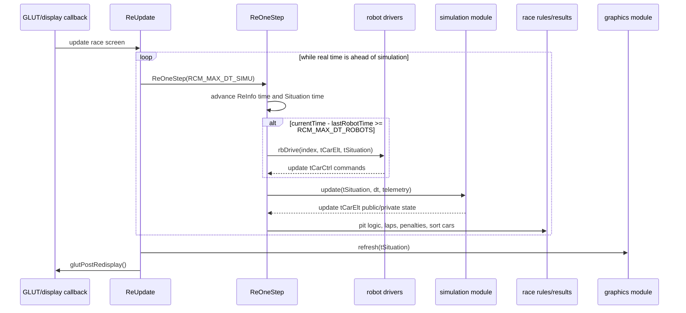
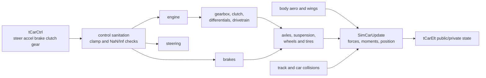
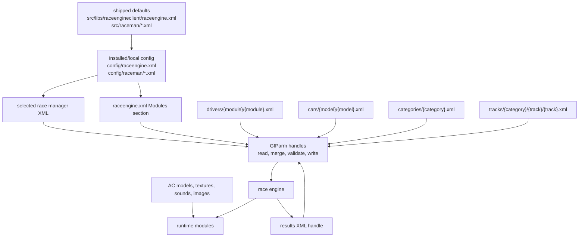

# TORCS Architecture and Theory of Operation

This document explains the first-party TORCS source tree as of the 1.3.9-test1
codebase. It covers the runtime, public interfaces, dynamically loaded modules,
drivers, tools, tests, and configuration/data flow. It intentionally excludes
vendored Windows dependency source, generated/exported outputs, runtime binary
directories, and bulk media assets except where they are architecturally
important.

## System Overview

TORCS is a plugin-oriented racing simulator. The executable is small: it
initializes platform services and screen handling, then delegates almost all
behavior to shared libraries, XML parameter files, runtime-loaded modules, and
driver plugins.

The central runtime object is `ReInfo` (`tRmInfo`), allocated by the race engine.
It owns the current `tSituation`, the current `tTrack`, the race manager XML
handle, results, car list, per-car rules, and the loaded module interface
tables. Each loaded module fills a struct of function pointers; the race engine
uses those callbacks without knowing the concrete implementation.

## Source Map

| Area | Main paths | Responsibility |
| --- | --- | --- |
| Platform entrypoints | `src/linux`, `src/windows` | Parse command-line flags, set local/data/library directories, install OS-specific module and time functions, enter GUI or headless race mode. |
| Public interfaces | `src/interfaces` | ABI contracts shared by the race engine, modules, tools, and drivers: car, track, robot, simulation, graphics, telemetry, race manager state. |
| Core framework | `src/libs/tgf`, `src/libs/tgfclient`, `src/libs/txml` | Parameter/XML handles, logging, hash/list helpers, module API facade, OS dispatch table, GLUT GUI, input, image/font/screen handling. |
| Game shell | `src/libs/client`, `src/libs/confscreens`, `src/libs/racescreens` | Splash screen, main menu, option/config menus, race setup screens, loading/result/pit/setup screens. |
| Race engine | `src/libs/raceengineclient` | Race lifecycle state machine, race manager selection, track/car initialization, fixed-step race loop, rules, results, cleanup. |
| Runtime modules | `src/modules` | Dynamically loaded track loader, simulation engines, PLIB/SSG graphics and sound, telemetry. |
| Drivers | `src/drivers` | Human driver and AI robot modules. Each plugin can expose multiple driver instances through `tModInfo` entries. |
| Tools | `src/tools` | Asset and authoring utilities such as `trackgen`, `accc`, `texmapper`, `nfs2ac`, and `nfsperf`. |
| Data | `data`, plus shipped config sources in `src/raceman` and `src/libs/raceengineclient` | Cars, categories, tracks, images, sounds, race manager templates, and default module selection. |
| Tests | `test` | Windows GTest projects for robottools and simuv2 subsystems, plus trackgen regression scripts. |

## Startup Paths

The Linux and Windows entrypoints share the same high-level split:

- GUI mode: initialize screen/UI, call `TorcsEntry()`, then let GLUT drive the
  event loop.
- Headless mode: `-r <race.xml>` bypasses GLUT graphics/audio and runs
  `ReRunRaceOnConsole()` for scripted races.

Windows adds local-user setup: it locates the executable directory, sets fallback
local/data/library directories, then copies default files such as
`config/raceengine.xml`, `config/graph.xml`, `config/screen.xml`,
`config/sound.xml`, `drivers/human/*.xml`, and `config/raceman/*.xml` into the
local application data directory if missing.

## Module System

`tgf/module.cpp` is a platform-neutral facade. It calls function pointers in the
global `GfOs` table; Linux fills those with `dlopen`/`dlsym` implementations in
`linuxspec.cpp`, and Windows fills equivalent DLL loaders in `windowsspec.cpp`.

Entry names are derived from the module file name. For example, loading
`modules/simu/simuv2.so` looks up the exported `simuv2(tModInfo*)`, and loading
`modules/graphic/ssggraph.so` looks up `ssggraph(tModInfo*)`.

| Plugin family | Interface | Loader/use site | Main callbacks |
| --- | --- | --- | --- |
| Track loader | `tTrackItf` in `track.h` | Loaded in `ReInit()` and `ReRunRaceOnConsole()` from `config/raceengine.xml` | `trkBuild`, `trkBuildEx`, coordinate conversion, height/normal queries, shutdown. |
| Simulation | `tSimItf` in `simu.h` | Loaded at race start by `ReRaceStart()` | `init`, `config`, `reconfig`, `update`, `shutdown`. |
| Graphics | `tGraphicItf` in `graphic.h` | Loaded in GUI `ReInit()` | Track/cars/view initialization, frame refresh, audio mute, shutdown. |
| Robots/human | `tRobotItf` in `robot.h` | Loaded per racing driver by `ReInitCars()` | `rbNewTrack`, `rbNewRace`, `rbDrive`, `rbPitCmd`, `rbShutdown`. |
| Telemetry | `tTelemItf` in `telemetry.h` | Available through robottools; currently compiled behind disabled code paths in `rttelem.cpp` | Channels, start/stop monitoring, update, shutdown. |

## Race Engine State Machine

`ReStateManage()` is the race engine automaton. Some states run synchronously
until they reach the race loop; GUI screens can return async mode and resume via
hooks.

The race setup sequence is data-driven:

1. `raceengine.xml` selects the track, simulation, and graphics modules.
2. A race manager XML file selects tracks, race sessions, rules, display mode,
   starting order, driver modules, and driver indices.
3. The track module builds `tTrack` from `tracks/<category>/<name>/<name>.xml`.
4. `ReInitCars()` loads each requested driver module, chooses a `tModInfo`
   entry by index or driver name, reads driver/car/category XML, lets the robot
   modify car settings through `rbNewTrack`, merges parameter handles, and
   creates `tCarElt` entries.
5. The simulation module receives the car count, current track, and rule
   factors, then configures each car at its starting-grid position.

## Per-Frame and Fixed-Step Operation

The displayed frame rate and physics rate are separate. The race engine advances
simulation in fixed `RCM_MAX_DT_SIMU` slices of 0.002 seconds. Robot driver
callbacks run less frequently, at `RCM_MAX_DT_ROBOTS` intervals of 0.02 seconds,
and their control commands are held between calls.

Display modes change how `ReUpdate()` schedules work:

| Mode | Behavior |
| --- | --- |
| Normal | Catch up to wall-clock time, render UI and 3D scene every display callback. |
| None | Run simulation without 3D rendering, refreshing the lightweight result screen occasionally. |
| Capture | Advance by capture cadence, render and write PNG frames. |
| Console | Run synchronously in large chunks without screen, OpenGL, OpenAL, or human drivers. |

## Core Runtime Data

| Type | Owner | Purpose |
| --- | --- | --- |
| `tRmInfo` | Race engine global `ReInfo` | Top-level race context: current track, situation, parameter handles, results, drivers, module interfaces, rules, and movie capture state. |
| `tSituation` | `ReInfo->s` | Shared current-race view passed to robots, simulation, graphics, and result code. Contains race admin info, current time, delta time, and ordered car pointers. |
| `tCarElt` | `ReInfo->carList` | Main car record. Contains static driver/car info, public physics state, race timing/ranking fields, private driver/simulation state, control commands, pit commands, and robot pointer. |
| `tTrack` / `tTrackSeg` | Track module | Circular segment graph, side segments, surfaces, barriers, pits, cameras, graphic metadata, and coordinate conversion support. |
| `tModInfo` / `tModList` | Platform module loader | Describes a loaded shared library entry and its callback initializer. Driver modules use arrays of `tModInfo` for multiple instances. |
| `parmHandle` | `tgf/params.cpp` | In-memory XML parameter tree with section/parameter hashes, refcounted handles, unit conversion, list iteration, merging, and serialization. |

## Simulation Module

The default `raceengine.xml` selects `simuv2`; the tree also contains `simuv3`,
which has the same broad interface with additional option handling.

`SimUpdate()` updates atmosphere, steering, gearbox, brakes, aero, wings,
axles/suspension/wheels, drivetrain, collisions, and final car integration for
each simulated car. It also handles cars that are broken, eliminated, out of
fuel, pitted, or being pulled off the track.

The simulation module reads car/category parameter handles assembled by the race
engine. It exposes a smaller public state back through `tCarElt`, while keeping
its internal `tCar` array private inside the module.

## Track Loading and Geometry

The track module reads XML track definitions and builds a `tTrack`. Version 0-3
tracks go through `ReadTrack3`; version 4 tracks go through `ReadTrack4`.
`TrackBuildEx()` adds graphic extensions and is used by `trackgen`, while normal
race startup uses `TrackBuildv1()`.

Important track services are:

- global/local coordinate conversion for cars, tools, and robot helpers
- height and surface-normal queries for physics and rendering
- side-normal queries for tests and robottools
- pit lane metadata, start/finish markers, and race segment flags
- surfaces, barriers, cameras, environment/background metadata, and object maps

## Graphics, Sound, and UI

The shipped graphics module is `ssggraph`, based on OpenGL and PLIB SSG. It
loads the track scene, car models, textures, shadows, skid marks, smoke, boards,
track maps, cameras, lights, and sound interfaces. It reads display and sound
options from local XML files such as `config/graph.xml` and `config/sound.xml`.

`tgfclient` owns the 2D GUI and screen system. Race screens add key callbacks
for pause, camera selection, zoom, split-screen controls, time multiplier, and
race stop/resume hooks. Human input is normalized by `control.cpp` and consumed
by the `human` driver plugin, so humans participate through the same robot
callback interface as AI drivers.

## Drivers

Drivers are runtime-loaded modules under `src/drivers`. Most AI drivers follow
the same shape:

- an exported function named after the module, such as `inferno(tModInfo*)`
- one or more `tModInfo` entries, usually one per numbered driver instance
- an initializer that fills `tRobotItf`
- `rbNewTrack` for track and car-parameter preparation
- `rbNewRace` for per-race setup
- `rbDrive` for control commands
- optional `rbPitCmd` and `rbShutdown`

The human driver is not special to the race loop. It maps keyboard, mouse, and
joystick inputs into `tCarCtrl`, then returns through `rbDrive` like any robot.
Console mode rejects human drivers because it intentionally avoids screen/input
initialization.

## Configuration and Data Flow

The parameter system is deliberately broad: the same API reads race managers,
driver descriptors, car definitions, track definitions, graphics settings,
sound settings, control preferences, generated results, and tool configs. It
supports section trees, repeated list entries, string and numeric values,
constraints, units, merging, private handles, and XML writing.

## Tools and Tests

| Tool/test area | Role |
| --- | --- |
| `trackgen` | Loads the track module, builds track geometry with extensions, writes AC3D track/terrain/object output, calculates track metrics, and supports bump/raceline/object generation workflows. |
| `accc` | Converts and optimizes AC3D/OBJ-style assets, including grouping, strips, normals, textures, and object merging. |
| `texmapper` | Generates texture mapping data for track assets. |
| `nfs2ac`, `nfsperf`, `png2jpg` | Legacy/import helper tools for assets and car performance data. |
| `test/libs/*` | GTest projects for robottools and simuv2 components such as aero, axle, brakes, differentials, engine, steering, suspension, and transmission. |
| `test/trackgen` | Shell regression scripts for generated track output. |

## Architectural Invariants

- Runtime polymorphism is C ABI based, not C++ inheritance based. Modules export
  a known symbol, return `tModInfo`, then fill C structs of function pointers.
- `tSituation` and `tCarElt` are the cross-module truth during a race. Robots
  write controls; simulation writes physical state; race engine writes rules,
  timing, ranking, and messages; graphics reads the resulting view.
- Simulation time is fixed-step. Rendering, capture, headless execution, and
  time scaling affect scheduling, not the core physics step size.
- XML parameter handles are the repository-wide configuration currency. Most
  subsystems use `GfParm*` rather than bespoke parsers.
- Tools reuse runtime modules where practical. `trackgen`, for example, loads
  the same track module as the game instead of maintaining a separate track
  parser.
- The source is designed around install/runtime directories. Files under
  `export`, `runtime`, and `runtimed` are outputs or staging products; edit the
  originals under `src` and `data`.

## Key Source References

| Topic | Source paths |
| --- | --- |
| Entry points | `src/linux/main.cpp`, `src/windows/main.cpp`, `src/libs/client/entry.cpp` |
| Race state machine | `src/libs/raceengineclient/racestate.cpp`, `racemain.cpp`, `raceengine.cpp`, `raceinit.cpp` |
| Public runtime data | `src/interfaces/raceman.h`, `car.h`, `track.h` |
| Plugin contracts | `src/interfaces/robot.h`, `simu.h`, `graphic.h`, `telemetry.h` |
| Module loading | `src/libs/tgf/module.cpp`, `src/libs/tgf/os.cpp`, `src/linux/linuxspec.cpp`, `src/windows/windowsspec.cpp` |
| XML parameter system | `src/libs/tgf/params.cpp`, `src/libs/txml` |
| Simulation | `src/modules/simu/simuv2`, `src/modules/simu/simuv3` |
| Track module | `src/modules/track` |
| Graphics/sound module | `src/modules/graphic/ssggraph` |
| Drivers | `src/drivers` |
| Menus and screens | `src/libs/client`, `src/libs/confscreens`, `src/libs/racescreens`, `src/libs/tgfclient` |
| Tools and tests | `src/tools`, `test` |
