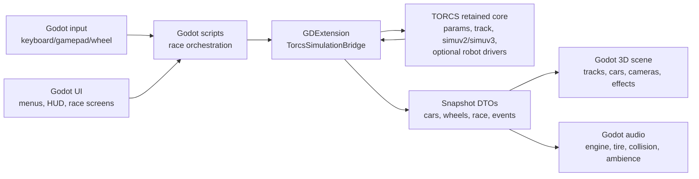

# TORCS to Godot Port Strategy

This document describes a practical strategy for moving TORCS into a Godot-based
runtime while preserving the valuable vehicle simulation work and replacing the
legacy media layer. It is written for the TORCS 1.3.9-test1 source tree in this
repository.

The short recommendation is: do not begin with a full rewrite. Build a Godot
front end around a native TORCS simulation core, prove one car on one track, and
then replace subsystems deliberately.

## Goals

Primary goals:

- Preserve the TORCS vehicle physics feel, car setup data, track surface
  behavior, AI/human control model, and race-rule semantics where useful.
- Replace the legacy graphics, audio, UI, input presentation, cameras, effects,
  asset pipeline, and distribution shell with Godot.
- Keep the simulation deterministic enough for debugging, replays, AI work, and
  regression testing.
- Avoid carrying PLIB, SSG, GLUT, and OpenAL-era presentation code into the new
  runtime.
- Build a staged migration path where each milestone is testable.

Non-goals for the first pass:

- Rewriting the vehicle dynamics model in Godot physics.
- Replacing the TORCS track/contact model before the retained physics path is
  proven.
- Recreating the full TORCS menu/race manager UI before a driveable prototype
  exists.
- Reusing every legacy media asset exactly as-is.
- Replacing the Godot engine source. GDExtension should be sufficient for the
  initial native integration.

## Current TORCS Shape

TORCS is already modular. The executable and UI shell delegate to runtime-loaded
modules through C-style interfaces. The architectural companion document
`doc/architecture.md` covers the full current runtime. The parts most relevant
to a Godot port are summarized here.

### Core interfaces

| Area | Source | Port relevance |
| --- | --- | --- |
| Race state | `src/interfaces/raceman.h` | Defines `tSituation`, race state, display modes, fixed step constants, and the top-level module table. |
| Car state | `src/interfaces/car.h` | Defines `tCarElt`, public transform/velocity, wheel state, controls, private sim data, damage, fuel, skid, collision, and messages. |
| Track state | `src/interfaces/track.h` | Defines `tTrack`, `tTrackSeg`, surfaces, pits, coordinate conversion, height, side normal, and surface normal callbacks. |
| Simulation | `src/interfaces/simu.h` | Defines `tSimItf`: `init`, `config`, `reconfig`, `update`, `shutdown`. This is the most important preserved interface. |
| Graphics | `src/interfaces/graphic.h` | Defines `tGraphicItf`, the legacy media interface to replace with Godot. |
| Drivers | `src/interfaces/robot.h` | Defines `tRobotItf`: AI and human drivers produce `tCarCtrl` commands through the same callback shape. |

### Simulation step model

TORCS separates rendering cadence from physics cadence:

- `RCM_MAX_DT_SIMU` is `0.002` seconds, a 500 Hz simulation step.
- `RCM_MAX_DT_ROBOTS` is `0.02` seconds, a 50 Hz control/AI step.
- `ReOneStep()` advances race time, calls robot `rbDrive` callbacks when due,
  calls `_reSimItf.update(...)`, applies race rules, and sorts cars.
- `ReUpdate()` catches simulation up to wall-clock time, then calls the graphics
  module `refresh(tSituation*)`.

This maps well to Godot if TORCS physics is kept as a fixed-step native
subsystem. Godot's `_physics_process(delta)` is fixed-rate, but its default rate
will usually be lower than TORCS' 500 Hz, so the bridge should run multiple TORCS
substeps per Godot physics frame.

### Useful TORCS runtime invariants

- `tSituation` and `tCarElt` are the shared race truth. Robots write controls,
  simulation writes physical state, race engine writes timing/ranking/rules, and
  graphics reads the resulting view.
- The simulation owns an internal `tCar` array and copies selected data back to
  `tCarElt`.
- Track services are part of the physics contract, not just rendering data.
  Height, normal, local/global conversion, surfaces, barriers, and pits must
  survive the first retained-physics implementation.
- The XML parameter system is central. Cars, categories, tracks, race managers,
  graphics settings, sound settings, driver descriptors, and results all use
  `GfParm*` handles.
- Existing tools reuse runtime modules. `trackgen` loads the same track module
  and is useful for validating track geometry and generated media.

## Godot Integration Facts

Relevant current Godot capabilities:

- GDExtension is the primary way to integrate native C/C++ code without
  modifying the Godot engine source:
  <https://docs.godotengine.org/en/stable/tutorials/scripting/gdextension/what_is_gdextension.html>
- GDExtension libraries can declare per-platform dependencies for export:
  <https://docs.godotengine.org/en/stable/tutorials/scripting/gdextension/gdextension_file.html>
- Godot fixed logic should run from `_physics_process(delta)`:
  <https://docs.godotengine.org/en/stable/tutorials/scripting/idle_and_physics_processing.html>
- Godot has `PhysicsServer3DExtension` for custom 3D physics servers, but this is
  a larger integration surface than a retained TORCS simulation bridge:
  <https://docs.godotengine.org/en/stable/classes/class_physicsserver3dextension.html>
- Godot supports custom editor importers for non-native asset formats:
  <https://docs.godotengine.org/en/stable/classes/class_editorsceneformatimporter.html>
  and <https://docs.godotengine.org/en/stable/tutorials/plugins/editor/import_plugins.html>
- `AudioStreamPlayer3D` supports spatial audio, pitch scaling, volume, distance
  attenuation, Doppler scaling, and bus routing:
  <https://docs.godotengine.org/en/stable/classes/class_audiostreamplayer3d.html>

Recommended interpretation: use GDExtension for the TORCS simulation bridge,
Godot scene nodes for presentation, Godot audio for playback, and editor import
plugins or offline converters for TORCS assets.

## Architecture Options Considered

| Option | Description | Strengths | Weaknesses | Recommendation |
| --- | --- | --- | --- | --- |
| Media-only replacement inside TORCS | Implement a new `tGraphicItf` module that embeds or talks to Godot. | Preserves TORCS race engine almost unchanged. | Godot is not designed to be a rendering plugin inside another GLUT-era app; editor workflow and export story become awkward. | Avoid except as a short-lived experiment. |
| Godot shell plus retained TORCS core | Godot owns runtime shell, visuals, audio, UI, input; native bridge owns TORCS physics and selected race state. | Preserves driving feel while replacing the media layer cleanly. | Requires careful native API and data conversion. | Best first architecture. |
| Full rewrite in Godot | Reimplement physics, track model, race rules, AI, and media in Godot. | Cleanest final code if successful. | Highest risk of losing vehicle feel and spending months before parity. | Defer until retained-core prototype exposes exactly what should be rewritten. |
| Custom Godot physics server | Implement TORCS physics through `PhysicsServer3DExtension`. | Deep engine-level integration. | Too broad for a first port; TORCS vehicle simulation is not a general-purpose rigid-body server. | Avoid initially. Revisit only if later engine integration demands it. |
| Separate TORCS process | Run TORCS physics as a separate executable and communicate over IPC. | Strong isolation, easier GPL boundary analysis in some distributions, crash containment. | Latency, packaging, synchronization, and debugging complexity. | Useful for tools, not the main interactive runtime unless licensing/process isolation requires it. |

## Recommended Architecture

The most pragmatic architecture is a dual-runtime split:



The bridge should expose a Godot-friendly API and hide TORCS internals:

- Load race definition.
- Load track.
- Load cars.
- Configure one or more drivers.
- Set human control inputs.
- Step the simulation by an exact duration.
- Return immutable snapshots for rendering/audio/UI.
- Emit events for collisions, lap changes, pit state, penalties, and race end.
- Shut down and release TORCS handles.

Do not expose raw `tCarElt*`, `tTrack*`, or `GfParm*` pointers directly to
GDScript as the long-term API. They are useful internally, but Godot code should
see stable value objects or arrays.

## What To Preserve, Replace, Or Rebuild

### Preserve first

- `src/modules/simu/simuv2` and probably `simuv3` as native libraries or linked
  source.
- `src/modules/track` and enough of `robottools` for track queries.
- `src/libs/tgf` parameter, directory, logging, time, and module support, unless
  a narrower static wrapper can be created.
- Car/category XML parsing and setup merge semantics.
- Track XML parsing and `tTrack` construction.
- `tSituation`, `tCarElt`, `tTrack`, and `tCarCtrl` as internal bridge structs.
- AI robot callbacks if AI behavior is part of the target product.

### Replace early

- `src/modules/graphic/ssggraph`.
- PLIB SSG scene graph usage.
- Legacy OpenGL rendering code.
- Legacy sound interfaces inside `ssggraph`.
- GLUT/tgfclient screen loop and 2D GUI.
- Menu and configuration screens as presentation UI.
- Capture pipeline based on `glReadPixels`.

### Rebuild deliberately

- Godot scenes for cars, wheels, tracks, barriers, pit lane objects, effects, and
  cameras.
- Godot HUD and menu flow.
- Input mapping for keyboard, controller, and steering wheel.
- Audio logic driven by RPM, throttle, wheel slip, skid, surface, speed,
  collision, damage, and camera/listener position.
- Asset conversion from AC3D/ACC/RGB/XML into Godot-friendly resources.
- Replay and telemetry export if needed.

## Bridge Design

### Native library shape

Prefer a new Godot-facing native library rather than loading TORCS modules in
their original game-shell shape. The bridge can either:

1. Link selected TORCS source modules statically into the GDExtension, or
2. Keep TORCS dynamic module loading and wrap it.

Static or direct linking is better for the first prototype:

- Easier debugging from Godot.
- Fewer platform-specific dynamic-loader surprises.
- Easier export packaging.
- Less need to emulate TORCS install directories exactly.

Dynamic module loading is useful later if preserving arbitrary robot modules is
important.

### Build system strategy

The first bridge should have two build targets:

- A command-line native harness that links the same retained TORCS subset and
  runs without Godot.
- A GDExtension library that exposes the same retained subset to Godot.

This keeps native debugging possible when Godot editor reloads, export packaging,
or script bindings obscure the real failure. It also gives deterministic
regression tests a place to run without launching the editor.

Keep Godot-facing code separate from TORCS source. Prefer small adapter files
over invasive edits in `src/modules/simu`, `src/modules/track`, and
`src/libs/tgf`.

### Suggested GDExtension classes

| Class | Responsibility |
| --- | --- |
| `TorcsRuntime` | One-time initialization of TORCS paths, logging, and parameter system. |
| `TorcsRace` | Owns one race session: track, cars, sim interface, drivers, current time, snapshots. |
| `TorcsRaceConfig` | Godot resource describing selected track, cars, rules, driver modules, and retained TORCS XML paths. |
| `TorcsCarSnapshot` | Value object for car transform, velocity, wheels, gear, RPM, fuel, damage, skid, collision, messages. |
| `TorcsTrackSnapshot` | Read-only metadata for track length, bounds, pits, surfaces, start positions, optional generated mesh references. |
| `TorcsInputState` | Steering, throttle, brake, clutch, gear, lights, pit request, brake balance. |
| `TorcsEvent` | Typed events for lap, collision, off-track, pit, penalty, finish, DNF. |

Keep the Godot-side API narrow:

```text
TorcsRuntime.initialize(data_root, local_root)
TorcsRace.load(config)
TorcsRace.set_human_input(car_index, input_state)
TorcsRace.step(seconds)
TorcsRace.get_snapshot()
TorcsRace.shutdown()
```

Internally, `TorcsRace.step(seconds)` should accumulate time and call the TORCS
fixed step repeatedly:

```text
accumulator += seconds
while accumulator >= 0.002:
    if robot timer is due:
        call robot control callbacks or apply Godot human input
    call sim.update(situation, 0.002, telemetry_car)
    apply minimal race rules needed by milestone
    accumulator -= 0.002
```

For initial development, call the existing race-engine step where practical. If
the race engine is too entangled with UI/module loading, reimplement the small
subset of `ReOneStep()` semantics needed for the prototype, then add race rules
back incrementally.

### Threading model

Start single-threaded:

- Godot calls `TorcsRace.step(...)` from `_physics_process(delta)`.
- The bridge runs all TORCS substeps synchronously.
- The bridge writes a new snapshot after stepping.
- Rendering/audio consume snapshots on the Godot side.

Do not run TORCS simulation concurrently with Godot rendering until the snapshot
contract and lifetime rules are proven. TORCS has substantial global state, so
multi-race and multi-thread execution should be treated as a later feature, not
an assumption.

### Snapshot boundary

Use snapshots to decouple Godot from TORCS memory ownership.

Each physics tick should produce:

- Race time, state, lap count, ordered car IDs.
- Per-car position, orientation, linear/angular velocity.
- Per-car RPM, gear, speed, throttle/brake/clutch commands.
- Wheel spin velocity, ride height, brake temperature, tire slip, tire force,
  tire wear/temperature, surface segment.
- Skid intensity, smoke amount, collision flag, collision position/force.
- Fuel, damage, local pressure, messages, lights, pit state.

Godot should render from the most recent snapshot, optionally interpolating
between the previous and current snapshots for visual smoothness. Do not
interpolate the data sent back into the physics core.

## Coordinate And Time Conversion

TORCS uses X/Y as the horizontal plane and Z as up. Godot uses X/Z as the usual
horizontal plane and Y as up. Centralize the conversion in one native or
GDScript utility and test it with a known straight track.

Likely conversion shape:

```text
Godot position = (torcs.x, torcs.z, torcs.y)
```

However, forward direction and handedness must be verified against a car driving
down a known start straight. Do not scatter axis swaps throughout rendering,
audio, camera, and import code.

Time rules:

- TORCS simulation time is authoritative.
- Godot rendering time is presentation only.
- Godot physics delta should be accumulated and consumed in 0.002 second TORCS
  steps.
- If Godot cannot keep up, cap catch-up work and choose a policy:
  deterministic slow-motion, frame skip, or temporary time resync.
- Keep robot/control updates at 0.02 seconds unless deliberately changed.

## Track And Asset Strategy

### Track data

There are two different concepts called "track":

1. Physics track: `tTrack` and `tTrackSeg`, required by TORCS physics.
2. Render track: mesh, materials, props, barriers, sky, lights, cameras, and
   environment, owned by Godot.

The first milestone should retain TORCS track loading for physics and use either
a simple generated debug mesh or a converted legacy mesh for rendering.

Track formats in this repository include:

- XML track definitions under `data/tracks/...`.
- AC3D `.ac` and optimized `.acc` render files.
- RGB/PNG textures.
- Elevation maps, object maps, relief files, and raceline images.
- Track authoring tools such as `trackgen` and `accc`.

### Physics/render alignment

Alignment needs explicit tooling. Build a debug overlay that can be toggled in
Godot and is generated from the TORCS physics track, not from the render mesh:

- Segment centerline.
- Left and right road borders.
- Side segments/barriers.
- Start/finish line.
- Pit entry, pit stalls, and pit exit.
- Surface names or color-coded surface IDs.
- Current wheel contact points and normals.

This overlay is the fastest way to diagnose axis mistakes, scale mistakes,
origin offsets, and mesh/physics drift.

### Render asset conversion options

| Option | Pros | Cons | Recommended use |
| --- | --- | --- | --- |
| Offline conversion to glTF | Native Godot workflow, clean materials, easy caching. | Requires converter maintenance. | Best long-term path. |
| Godot import plugin for AC/ACC | Smooth editor workflow, direct source import. | More editor plugin work. | Useful once format needs are known. |
| Runtime native loader | Fast prototype if reusing old loader logic. | Couples Godot runtime to legacy asset formats. | Avoid except for prototypes. |
| Rebuild media manually | Highest quality final result. | Slow, loses direct coverage of legacy content. | Best for flagship cars/tracks after pipeline is proven. |

Recommended sequence:

1. Generate a simple road mesh from `tTrackSeg` for debugging.
2. Convert one existing `.ac`/`.acc` track to glTF and align it to TORCS physics.
3. Build a repeatable converter/importer.
4. Replace legacy materials with Godot PBR materials.
5. Add props, lighting, sky, weather, cameras, and effects.

### Car assets

Car XML contains physical parameters and presentation references. Treat these as
separate outputs:

- Physics parameters stay in TORCS XML initially.
- Visual car body becomes a Godot scene.
- Wheels become separate nodes controlled by wheel snapshots.
- Materials and liveries become Godot resources.
- Engine audio mapping comes from RPM/gear/throttle plus a per-car audio config.

Keep a stable car ID that maps:

```text
TORCS car XML -> physics car
Godot PackedScene -> visual car
Godot audio config -> sound rig
Godot input/driver config -> controller
```

## Audio Strategy

Do not port `ssggraph` audio. Use Godot audio nodes driven by simulation
snapshots.

Per car, create an audio rig with:

- Engine loop layers driven by RPM and throttle.
- Transmission/gear whine if desired.
- Tire scrub/skid loops driven by `slipSide`, `slipAccel`, `skid`, and surface.
- Collision one-shots driven by collision events and force.
- Backfire or limiter events driven by RPM/throttle changes if desired.
- Wind/road noise driven by speed.
- Spatial placement from car transform and listener/camera.

Godot's `AudioStreamPlayer3D` gives spatial attenuation, pitch scaling, bus
routing, and optional Doppler. Use buses for engine, tire, collision, ambience,
UI, and music so the mix can be tuned independently.

Avoid coupling audio to render frame rate. Audio parameters should be derived
from the latest physics snapshot, smoothed on the Godot side, and one-shot
events should be debounced so a persistent collision flag does not retrigger the
same sound every frame.

## Graphics Strategy

The new graphics layer should be idiomatic Godot:

- Track as `Node3D` hierarchy with mesh instances, collision/debug overlays,
  lights, reflection probes, decals, and environment settings.
- Cars as `Node3D` scenes with body mesh, wheels, suspension visual offsets,
  lights, brake lights, damage effects, and optional driver/cockpit.
- Cameras as Godot camera controllers reading the same snapshots as rendering.
- HUD as Godot `Control` scenes.
- Effects as particles/decals/audio events, not C++ OpenGL code.

Drive visuals from snapshots:

- Body transform from car position/orientation.
- Wheel rotation from wheel spin velocity.
- Wheel vertical offset from ride height.
- Steering visual angle from control/suspension state.
- Skid marks from wheel slip/skid and surface contact.
- Smoke from private smoke/skid state.
- Damage from collision/damage state.
- Lights from light command and brake/throttle state.

## Input And Driver Model

TORCS treats human drivers and AI drivers through the same robot callback
interface. The Godot port can use that idea without keeping the old human driver.

Recommended model:

- Godot input maps keyboard/gamepad/wheel to `TorcsInputState`.
- The bridge writes `TorcsInputState` into the controlled car's `tCarCtrl`.
- Existing AI robots can still run through `rbDrive` if dynamic modules are
  preserved or linked.
- Multiplayer/local split-screen can be added by assigning multiple Godot input
  devices to multiple human-controlled cars.

Wheel support should be isolated behind a Godot input calibration UI, not copied
from the old GLUT/tgfclient control system.

## Race Rules And UI Scope

A driveable prototype does not need the full TORCS race manager UI. It does need
enough race state to exercise physics correctly.

Bring rules back in layers:

1. Free drive: one track, one car, reset/restart.
2. Practice session: laps, timing, off-track state, simple finish line crossing.
3. Multi-car race: grid, countdown, ranking, finish, DNF.
4. Pits, fuel, damage, tire changes, penalties.
5. Championships/results/config persistence.

For the first prototype, a small Godot `TorcsRaceConfig` resource can replace
the XML race manager UI while still pointing to TORCS track/car XML files.

## Licensing And Content Constraints

TORCS code is GPL-licensed. `COPYING` is GPL v2, and source headers generally
say GPL v2 or later. Godot is MIT-licensed, which is permissive and generally
compatible with GPL distribution, but using TORCS code in the shipped product
will make the combined distributed work subject to GPL obligations. This is not
legal advice; verify the exact intended distribution model before release.

Important content note from `README`: some included artwork is non-free in the
GPL sense, specifically directories matching:

- `data/cars/models/pw-*`
- `data/cars/models/kc-*`

The README says other content is GPL or Free Art License unless noted. A media
overhaul is a good time to inventory content licenses and avoid carrying
ambiguous legacy media into the new project.

Practical policy:

- Keep license metadata with every converted asset.
- Separate code, converted legacy assets, and newly authored assets.
- Prefer newly authored or clearly licensed media for any public release.
- Keep the TORCS-derived native code source available if distributing binaries.
- Check whether dynamic linking or process separation changes obligations for
  your target distribution. Do not rely on assumptions here.

## Main Risks

| Risk | Why it matters | Mitigation |
| --- | --- | --- |
| Physics/runtime entanglement | The sim depends on track, params, race state, globals, and module conventions. | Preserve enough TORCS runtime first; shrink later. |
| 500 Hz cost | Godot default physics rate is much lower than TORCS sim rate. | Native substeps, profiling, cap catch-up, optimize only after measuring. |
| Coordinate mismatch | TORCS is Z-up; Godot is Y-up. | One tested transform mapper, debug axes, known-track validation. |
| Asset alignment | Render mesh and physics track can visually diverge. | Debug overlay of physics centerline, borders, wheels, and contact points. |
| Legacy formats | AC3D/ACC/RGB are not ideal Godot-native assets. | Start with debug mesh, then build glTF conversion pipeline. |
| Global state | TORCS assumes process-wide globals such as `ReInfo`, `SimCarTable`, and local/data directories. | One race session at a time initially; encapsulate globals in bridge lifecycle. |
| AI modules | Robot plugins use TORCS module loading and direct structs. | Defer plugin compatibility or link selected robots first. |
| Licensing | GPL code and mixed media licenses affect distribution. | Keep inventory and choose target license/distribution strategy early. |
| Debugging difficulty | Native crashes from Godot are harder to diagnose. | Build a standalone bridge test harness before relying on the editor. |

## Performance Budget

The key cost is TORCS' 500 Hz fixed step. A Godot project running physics at
60 Hz will need about 8 or 9 TORCS substeps per Godot physics frame. At 120 Hz,
it will need about 4 or 5. Multi-car sessions multiply the simulation and
snapshot cost.

Track these metrics from the first prototype:

- TORCS substeps per rendered frame.
- Native step time per car.
- Snapshot copy time.
- Godot transform/audio update time.
- Worst-case catch-up loop count.
- Memory allocations per physics frame.

Optimization policy:

- First make the native harness deterministic and correct.
- Then eliminate per-step heap allocation at the bridge boundary.
- Then profile multi-car sessions.
- Only then consider lower sim rates, broad threading, or physics model changes.

## Strategic Implementation Plan

The optimal plan is milestone-based. Each milestone should produce a working
artifact and a regression check.

### Phase 0: Decision And Scope Lock

Output: one-page project charter.

Decide:

- Target Godot version.
- Target platforms.
- Whether the final product can be GPL.
- Whether existing TORCS AI drivers are required.
- Whether legacy tracks/cars are compatibility targets or just migration
  references.
- One initial car and one initial track.
- One initial driving mode: free drive or practice.

Recommended initial target:

- Godot 4.x stable.
- Desktop only.
- GPL-compatible distribution assumed.
- One human car.
- One simple track.
- `simuv2` retained.
- Debug mesh first, art conversion second.

### Phase 1: Native Simulation Harness Outside Godot

Output: command-line executable that loads one track and one car, steps physics,
and writes snapshots.

Tasks:

- Create a small C++ harness in a new experimental directory.
- Initialize TORCS data/local/library paths.
- Load one track XML through the track module or linked track code.
- Create one `tSituation` and one `tCarElt`.
- Configure `simuv2`.
- Apply a scripted control sequence.
- Step 10 seconds at 0.002 seconds.
- Emit CSV/JSON snapshots of position, yaw, speed, RPM, gear, wheel spin, skid,
  and damage.

Acceptance criteria:

- The car accelerates, steers, brakes, and remains numerically stable.
- Repeated runs produce equivalent snapshots.
- No graphics, audio, GLUT, or `ssggraph` dependency is required.

This phase is the most important de-risking step. If it is painful, fix the
native boundary before adding Godot.

### Phase 2: Minimal GDExtension Bridge

Output: Godot project can load the native bridge and step a race.

Tasks:

- Create a Godot project, probably outside `torcs/torcs` or under a clearly
  separated `godot/` directory.
- Add GDExtension build scripts.
- Wrap the Phase 1 harness in `TorcsRuntime` and `TorcsRace`.
- Expose `load`, `step`, `set_human_input`, `get_snapshot`, and `shutdown`.
- Add a standalone native unit test target for the bridge.
- Add a Godot smoke scene that prints speed/RPM from snapshots.

Acceptance criteria:

- Godot can run the bridge for at least 60 seconds without leaks/crashes.
- Snapshot values match the Phase 1 harness for the same input sequence.
- The native library exports and reloads cleanly during development.

### Phase 3: Debug 3D Visualization

Output: one driveable Godot scene with simple generated visuals.

Tasks:

- Generate or import a simple track centerline/road ribbon from `tTrackSeg`.
- Spawn a placeholder car mesh.
- Map TORCS transforms into Godot transforms.
- Add debug overlays for centerline, segment boundaries, wheel contact points,
  and surface names.
- Implement camera follow and reset.
- Apply keyboard/gamepad input to `TorcsInputState`.

Acceptance criteria:

- The placeholder car visibly drives on the debug track.
- Visual position matches TORCS track-local position.
- Steering, throttle, brake, clutch/gear path works.
- The car does not appear mirrored, sideways, underground, or offset from the
  physics road.

### Phase 4: First Real Track And Car Media

Output: one visually recognizable track and car in Godot.

Tasks:

- Convert one car body and wheels to Godot scenes.
- Convert one track render mesh to glTF or build an importer.
- Align converted render mesh with TORCS physics.
- Add basic PBR materials.
- Add wheel rotation and steering visuals.
- Add brake lights/headlights if source state is available.
- Add basic sky/environment and camera set.

Acceptance criteria:

- Rendered track and physics track stay aligned through a full lap.
- Wheels contact the road visually within acceptable tolerance.
- Visual frame rate is stable with the native sim running.

### Phase 5: Audio Prototype

Output: believable per-car audio using Godot audio.

Tasks:

- Create a per-car audio rig with `AudioStreamPlayer3D` nodes.
- Map RPM/throttle to engine loop pitch/volume.
- Map speed/slip/skid/surface to tire noise.
- Trigger collision one-shots from collision events.
- Add bus layout and simple mix controls.

Acceptance criteria:

- Engine pitch tracks RPM smoothly.
- Tire noise appears only under meaningful slip/skid conditions.
- Collision sounds are event-driven and do not repeat every frame.
- Audio spatialization follows car and camera/listener position.

### Phase 6: Race Features And AI

Output: practice or race session with useful gameplay rules.

Tasks:

- Reintroduce lap timing, ranking, finish line detection, and result state.
- Add countdown/start behavior.
- Add reset/recover logic.
- Decide whether to preserve TORCS robot modules dynamically or port selected
  AI logic into the bridge.
- Add multi-car stepping and snapshots.
- Add collision/rules validation.

Acceptance criteria:

- Multi-car sessions run deterministically enough for testing.
- Existing AI or a replacement AI can complete laps.
- Race state shown in Godot HUD matches native state.

### Phase 7: Asset Pipeline And Editor Workflow

Output: repeatable pipeline for tracks, cars, materials, sounds, and configs.

Tasks:

- Build offline converters or Godot import plugins for selected TORCS formats.
- Convert textures from RGB to Godot-friendly image formats.
- Convert AC/ACC meshes to glTF or native mesh resources.
- Generate collision/debug overlays from `tTrack`.
- Create metadata resources linking TORCS XML to Godot scenes.
- Add import validation checks: scale, axes, missing textures, material count,
  origin alignment, wheel node names.

Acceptance criteria:

- A second track and second car can be imported without code changes.
- Import output is deterministic and cacheable.
- License metadata survives conversion.

### Phase 8: Productization

Output: distributable Godot build.

Tasks:

- Package native libraries per platform.
- Define export templates and GDExtension dependency paths.
- Add crash logging and native error reporting.
- Add settings UI.
- Add save/config migration.
- Add replay or ghost support if desired.
- Add performance profiling scenes.
- Audit licenses and source distribution requirements.

Acceptance criteria:

- Clean fresh checkout can build native bridge and Godot project.
- Exported build runs without editor-only paths.
- License notices and source availability are handled.

## Testing Strategy

Use three layers of tests.

### Native tests

- Load/step/shutdown smoke test.
- Deterministic scripted input test.
- Track coordinate conversion tests.
- Car control clamp tests.
- Snapshot serialization tests.
- Regression snapshots for one car/track/scripted input.

### Godot integration tests

- GDExtension load/unload smoke scene.
- Snapshot-to-transform conversion tests.
- Axis/handedness visual test scene.
- Input mapping tests.
- Audio event debounce tests.

### Visual validation

- Screenshot car position at known time stamps.
- Debug overlay for physics centerline and boundaries.
- Wheel contact marker overlay.
- Track mesh alignment checklist.
- Performance capture with substep count, frame time, and snapshot copy cost.

## First Prototype Checklist

Build the smallest useful prototype in this order:

1. Choose `simuv2`, one car, and one short track.
2. Make a command-line harness run 10 seconds of scripted physics.
3. Extract stable snapshots.
4. Wrap the harness in GDExtension.
5. Show speed/RPM in Godot.
6. Render placeholder car at the TORCS transform.
7. Render debug road geometry.
8. Add keyboard input.
9. Drive a full lap.
10. Add one real car mesh.
11. Add one real track mesh.
12. Add engine audio.

Do not start with final UI, final media, or a custom Godot physics server.

## Key Starting Files

Start source inspection and extraction from these files:

| Need | Files |
| --- | --- |
| Fixed-step loop and race stepping | `src/libs/raceengineclient/raceengine.cpp`, `src/interfaces/raceman.h` |
| Race setup and car initialization | `src/libs/raceengineclient/raceinit.cpp`, `src/libs/raceengineclient/racemain.cpp` |
| Simulation interface | `src/interfaces/simu.h`, `src/modules/simu/simuv2/simu.cpp`, `src/modules/simu/simuv2/simuitf.cpp` |
| Track interface and loader | `src/interfaces/track.h`, `src/modules/track/track.cpp`, `src/modules/track/trackitf.cpp`, `src/modules/track/track3.cpp`, `src/modules/track/track4.cpp` |
| Car state and controls | `src/interfaces/car.h` |
| Driver callback model | `src/interfaces/robot.h`, `src/drivers/human`, one simple AI driver such as `src/drivers/sparkle` |
| XML/config runtime | `src/libs/tgf/params.cpp`, `src/libs/tgf/module.cpp`, `src/libs/tgf/os.cpp` |
| Legacy media to replace | `src/modules/graphic/ssggraph` |
| Asset tools | `src/tools/trackgen`, `src/tools/accc`, `src/tools/texmapper` |
| Existing architecture reference | `doc/architecture.md` |

## Open Technical Questions

Answer these during phases 1-3:

- Can the retained TORCS core be linked cleanly into one GDExtension, or is
  dynamic module loading required for important behavior?
- Which parts of `raceengineclient` are worth preserving versus replacing with
  a smaller Godot race orchestrator?
- What is the exact TORCS-to-Godot axis mapping after observing a known track?
- Can `simuv2` and `simuv3` coexist behind the same bridge API?
- Which robot drivers are worth keeping?
- How much of the XML parameter system should remain user-facing?
- Which legacy assets are legally and artistically worth converting?
- Is deterministic replay a hard requirement?
- How many cars can run at 500 Hz on target hardware?

## Recommended Repository Shape

A clean long-term layout could look like this:

```text
torcs/torcs/
  src/                         # Existing TORCS source, minimally modified.
  doc/
    architecture.md
    godot-port-strategy.md
  godot/
    project.godot
    addons/
      torcs_importers/
    scenes/
    scripts/
    assets/
    native/
      torcs_gdextension/
        src/
        include/
        tests/
        SConstruct or CMakeLists.txt
```

Keep the original TORCS code buildable while the Godot project grows. Avoid
editing `export`, `runtime`, and `runtimed`; those are generated/staging outputs.

## Strategic Bottom Line

TORCS is a good candidate for a Godot media overhaul because its core simulation
already publishes state through clear C structs and does not require the legacy
graphics module to update physics. The main engineering challenge is not
rendering. It is building a stable native boundary around TORCS' fixed-step
simulation, XML/config runtime, track queries, and global state.

The safest path is:

```text
Retain physics -> prove native harness -> wrap with GDExtension ->
debug visualize -> convert first assets -> add audio -> restore race features ->
generalize pipeline.
```

Once that path is working, selective rewrites become much easier because Godot
will already provide the new presentation shell and test harness around the
driving feel you want to preserve.
